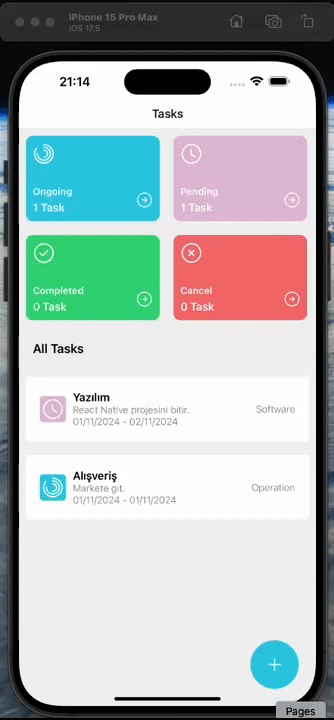

# Tasks App - React Native

This project developed with React Native is a task management application. In the application, users can add, view, update and delete tasks. Tasks can be categorized as ongoing, pending, completed or canceled.

## Technologies and Libraries Used

- eva-design/eva
- react-native-async-storage
- react-navigation/native-stack
- iconsax-react-native
- ui-kitten/components
- react-native-screens
- react-native-svg
- react-native-uuid
- formik
- yup
- moment

## GIF

# Tasks-App-React-Native
